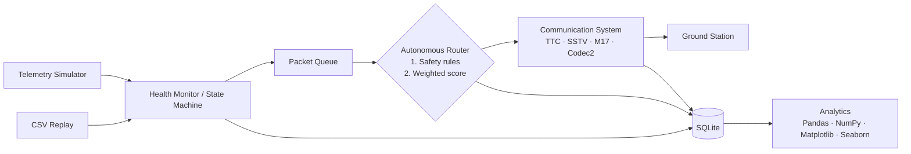

# SomaiyaSat Mission Control

**Autonomous Satellite Operations Digital Twin**, a Python / Tkinter desktop mini-project.

> This project is an educational software simulation/digital twin inspired by the SomaiyaSat mission
> use case. It does not communicate with real spacecraft hardware, implement actual RF protocols, or
> provide flight-qualified control logic.

---

## 1. Overview

SomaiyaSat Mission Control simulates a PocketQube satellite mission from a ground-control desk.
The simulation runs continuously:

* the satellite generates telemetry (battery, temperature, signal, power);
* the satellite also generates data packets (TT&C, Housekeeping, SSTV images, M17 and Codec2 voice);
* an **autonomous decision engine** decides, every half-second, which packet to send, when to send it,
  and through which radio mode, or whether to hold everything for safety;
* operators can inject failures such as a thermal spike, signal loss or a corrupted packet, and watch the
  system react;
* historical missions can be replayed from CSV files;
* everything is stored in **SQLite** and later analysed with **Pandas, NumPy, Matplotlib and Seaborn**.

It runs fully offline as one Tkinter window with 8 screens.

## 2. Problem statement

PocketQube satellites are tiny (5 cm cubes). They have very little power, little onboard computing,
narrow radio bandwidth and only a few minutes of contact with a ground station per orbit. When
several kinds of data compete for that short window, such as critical health telemetry, voice
traffic and large images, the satellite must decide **on its own**:

* what to transmit now and what to postpone;
* which communication mode to use;
* when to stop transmitting to protect the battery or cool down (safe mode).

It must also **explain** those decisions so that engineers can trust and debug them.

## 3. AI use-case context

Assigned use case: *"SomaiyaSat & SomaiyaPod: A PocketQube Mission featuring Autonomous AI-Based
Inter-Satellite Data Routing and Advanced Multi-Mode Amateur Radio Payloads (M17, Codec2, SSTV, &
TT&C / Housekeeping)"*. Vertical: Space Technology and Remote Sensing.

The "AI" in this project is the **Autonomous Router**: a lightweight, explainable, rule-based and
score-based decision engine. It is **not** a machine-learning model. That is deliberate: onboard
software on a tiny satellite must be predictable, cheap to compute and explainable, and every decision
here can be traced to numbers stored in the database.

## 4. Objectives

1. Model the satellite, its subsystems, packets and radio modes with proper OOP.
2. Build an autonomous, explainable packet router with hard safety rules.
3. Show live telemetry, orbit and ground-pass state in a modern Tkinter GUI.
4. Use real multithreading, with safe communication between the threads and the GUI.
5. Persist every mission, telemetry frame, packet, decision and incident in SQLite.
6. Replay recorded missions from CSV and analyse them with Pandas, NumPy, Matplotlib and Seaborn.
7. Handle failures gracefully (corrupted data, link loss, bad CSV, database errors).

## 5. Features

| Screen | What it shows |
|---|---|
| **Landing** | Cinematic start screen: optional looping video, or a Canvas starfield with a rendered Earth and an orbiting satellite. Animated system initialisation, then *ENTER MISSION CONTROL*. |
| **Overview** | Five live metric cards, an animated 2D orbit with a ground-station beam, the AOS/LOS pass countdown, the current autonomous decision with *WHY THIS DECISION?*, and an event feed. |
| **Live Telemetry** | Current, min and max values for 8 channels and 4 embedded Matplotlib live charts (rolling deque buffer, redrawn at 1 Hz). |
| **Autonomous Router** | The packet queue table (ID, type, priority, size, age, minimum signal, energy, score, status), the score breakdown bars for the selected packet, a plain-English explanation, active safety rules and recent decisions. |
| **Communications** | Cards for TT&C / SSTV / M17 / Codec2, the live transmission panel, and an **SSTV downlink viewer** that reveals the image line by line, with noise when the signal is weak. |
| **Incident Simulator** | Eight fault buttons (battery drain, thermal spike, signal loss, communication failure, corrupted packet, packet burst, force safe mode, restore nominal), the live autonomous response, state transitions and incident history. |
| **Analytics & Replay** | CSV import with schema validation, preview, replay at 0.5×/1×/2×/5× with pause/resume/reset, KPI cards, 5 charts (including a Seaborn heatmap), mission summary and CSV exports. |
| **Mission Archive** | Every mission stored in SQLite, with search and filters, and tabs for telemetry, packets, decisions, incidents and state transitions. |

## 6. Architecture

```
┌──────────────────────────────────────────────────────────────┐
│                  Tkinter GUI  (main thread)                  │
│  Landing · Overview · Telemetry · Router · Comms · Incidents │
│            Analytics & Replay · Archive   (app/ui)           │
└───────────────▲───────────────────────────────┬──────────────┘
                │ root.after(50 ms) drains       │ operator actions
                │ events (queue.Queue)           │ (inject incident, replay…)
┌───────────────┴───────────────────────────────▼──────────────┐
│                MissionController  (app/core)                 │
│  worker threads: Telemetry · Health · Router · Transmission  │
│                  (+ Replay worker in replay mode)            │
└──┬──────────┬────────────┬─────────────┬──────────────┬──────┘
   │          │            │             │              │
TelemetrySim  GroundPass   Autonomous    Communication  Incident
(Satellite:   (AOS/LOS)    Router        System         Manager
 Power,                    (rules +      (TTC/SSTV/
 Thermal)                   scoring)      M17/Codec2)
   │          │            │             │              │
   └──────────┴────────────┴──────┬──────┴──────────────┘
                                  ▼
                     DatabaseManager → SQLite (data/somaiyasat.db)
                                  ▼
                     AnalyticsEngine → Pandas / NumPy / Matplotlib / Seaborn

   CSV file ─► ReplayEngine (Pandas validation) ─► MissionController (same pipeline)
   Incident buttons ─► MissionController.inject_incident ─► IncidentManager
```



## 7. OOP concepts used

| Concept | Where |
|---|---|
| Classes & objects | `Satellite`, `PowerSystem`, `ThermalSystem`, `DataPacket`, `PacketQueue`, `AutonomousRouter`, `MissionController`, `DatabaseManager` and more. |
| Constructors | Every class `__init__`; for example `DataPacket.__init__` validates the size and priority and computes a CRC32 checksum. |
| Encapsulation / data hiding | `PowerSystem.__battery` and `ThermalSystem.__temperature` are private, name-mangled attributes. They can only be changed through `consume_power()`, `recharge()`, `drain()` and `update()` (`app/models/satellite.py`). |
| Inheritance | `DataPacket` → `TTCPacket`, `HousekeepingPacket`, `SSTVPacket`, `VoicePacket` → `M17Packet`, `Codec2Packet` (`app/models/packet.py`). `GroundPass` → `ReplayGroundPass`. `BasePage` → the 7 GUI pages. |
| Abstract class (ABC) | `CommunicationMode(ABC)` with abstract `minimum_signal_required`, `estimate_transmission_time` and `transmit` (`app/models/communication_modes.py`). |
| Polymorphism | `mode.transmit(packet, signal, dt)` behaves differently in `TTCMode`, `SSTVMode`, `M17Mode` and `Codec2Mode`. Each GUI page overrides `handle_event()` and `on_show()`, and the app calls them uniformly. |
| Method overriding + `super()` | `SSTVMode.calculate_energy_cost()` extends the parent formula with the image-encoder energy. |
| Composition | A `Satellite` *has* a `PowerSystem` and a `ThermalSystem`. `MissionController` *has* a router, a queue, a comms system and so on. |
| Enums & dataclasses | `PacketType`, `PacketPriority`, `PacketStatus`, `MissionState`, `IncidentSeverity` … / `TelemetrySnapshot`, `RoutingDecision`, `ScoreBreakdown`, `Incident`, `PassInfo`. |
| Custom exceptions | `TelemetryCorruptionError`, `CommunicationFailureError`, `InvalidPacketError`, `DatabaseOperationError`, `ReplayDataError` (`app/exceptions.py`). |

## 8. Multithreading architecture

| Thread | Rate | Job |
|---|---|---|
| `TelemetryWorker` | 1 Hz | simulate battery, thermal, signal and power (live mode) |
| `ReplayWorker` | per CSV row | feed rows from a CSV instead (replay mode) |
| `HealthMonitorWorker` | 2 Hz | run the state machine and react to state changes |
| `RouterWorker` | 2 Hz | generate packets and run the autonomous router |
| `TransmissionWorker` | 10 Hz | advance the active transmission, detect failures, retry |

* Shared simulation objects are protected by one `threading.RLock`.
* **Worker threads never touch Tkinter**, because Tkinter is not thread-safe. They publish plain
  dictionaries to an `EventBus` (a `queue.Queue`). The GUI drains that queue every 50 ms with
  `root.after()` and updates the widgets on the main thread.
* Each mission has a `threading.Event` stop flag. `stop_mission()` sets it and joins every worker, so
  closing the window leaves no dangling threads, and the database is closed last.

## 9. Database design (SQLite, `data/somaiyasat.db`)

| Table | Key columns |
|---|---|
| `missions` | mission_id PK, mission_code (`SMC-20260925-003`), mission_name, mode (LIVE/REPLAY), started_at, ended_at, status, notes |
| `telemetry` | id PK, mission_id FK, timestamp, mission_time, battery, temperature, signal, power_draw, packet_loss, system_state |
| `packets` | packet_id PK, mission_id FK, packet_type, priority, size_kb, status, created_at, selected_at, transmitted_at, retry_count, corrupted, mode, score |
| `decisions` | decision_id PK, mission_id FK, packet_id, timestamp, selected_mode, total_score, priority_score, link_score, urgency_score, energy_score, waiting_score, battery, temperature, signal, system_state, **reason** |
| `incidents` | incident_id PK, mission_id FK, timestamp, incident_type, severity, description, resolved |
| `state_transitions` | id PK, mission_id FK, timestamp, from_state, to_state, reason |

All SQL lives in `app/database/database_manager.py`. It uses parameterised queries (`?`), a
single connection guarded by a lock, `with connection:` transactions, a whitelist for table names,
and schema creation on first run.

## 10. Autonomous routing logic

**Layer 1: safety rules.** These are hard constraints; a high score can never override them.

| Condition | Action |
|---|---|
| No active ground pass / RF link down | hold all packets |
| Mode not allowed in the current state | defer (e.g. LOW_POWER suspends SSTV + M17; THERMAL_ALERT allows only TT&C) |
| SAFE_MODE | only CRITICAL packets |
| Signal < 20 % | hold non-critical packets |
| Signal < mode minimum (TT&C 15, Codec2 30, M17 40, SSTV 55 %) | defer |
| LOW_POWER and energy > 12 J | defer |
| Estimated transmission time > time left until LOS | defer |
| CRC check fails (corrupted packet) | quarantine and log an incident |

**Layer 2: weighted score** (each component 0–100, total 0–100):

```
score = 0.35·priority + 0.25·link + 0.15·urgency + 0.15·energy + 0.10·waiting
```

* **priority:** CRITICAL 100, HIGH 80, MEDIUM 55, LOW 30.
* **link:** 50 when the signal just meets the mode's minimum, up to 100 on a perfect link.
* **urgency:** TT&C 100, Housekeeping 75, Codec2 50, M17 45, SSTV 35.
* **energy:** cheaper packets score higher. The penalty grows as the battery empties.
* **waiting:** grows with age and is maxed out at 150 s. This gives fairness, so low-priority packets
  are never starved.

The highest-scoring eligible packet wins. Selection is a single pass over the queue, O(n). Every decision
stores all five components, the telemetry context and a plain-English reason, for example:

> *Packet #104 was selected because it contains critical TT&C data and scored highest (88.0/100),
> mainly due to its priority. The current ground link (78 %) comfortably exceeds the 15 % that TT&C
> needs, and its low energy cost (0.4 J) is acceptable at 84 % battery.*

**Retry policy:** a failed transmission is requeued up to 2 times (4 for CRITICAL packets), then
marked FAILED. If the queue is full (40 packets), the lowest-priority, oldest packet is dropped.

## 11. Mission state machine

```
             battery < 25 %                 temp > 60 °C
 NOMINAL ─────────────────► LOW_POWER   NOMINAL ─────────► THERMAL_ALERT
    ▲  │ signal < 35 % in pass                                  │ temp > 70 °C
    │  └──────────────────► DEGRADED_LINK                       ▼
    │                                                       SAFE_MODE ◄── battery < 15 % / operator
    │  link failure ───────► COMMUNICATION_LOSS
    └── recovery (with hysteresis: e.g. leave THERMAL_ALERT only below 55 °C)
```

State priority: SAFE_MODE > COMMUNICATION_LOSS > THERMAL_ALERT > LOW_POWER > DEGRADED_LINK > NOMINAL.
The recovery margins (hysteresis) stop the state from flickering around a threshold. Every transition
is shown in the event feed and stored in `state_transitions`. Entering LOW_POWER, THERMAL_ALERT or
SAFE_MODE creates an incident automatically, and leaving the state resolves it.

## 12. Ground pass simulation

The orbit is simplified. The satellite angle increases steadily (one orbit = 180 s, pass = 60 s),
and the ground station sees it while it is within ±60° of the station. That gives the lifecycle
**PRE-PASS → AOS → ACTIVE PASS → LOS** with a live countdown. During a pass the signal follows a smooth
curve, `18 + 76·sin(π·progress)^0.8`, plus NumPy Gaussian noise. That means weak at AOS, strongest
mid-pass and weak again at LOS. **No orbital mechanics**: this is a compressed simulation for the demo.
The *Skip to next pass* button fast-forwards the orbit clock.

## 13. CSV mission replay

Schema: `timestamp,battery,temp,signal,power_draw,packet_loss,packet_type,priority,size_kb[,event]`

* `timestamp` may be `HH:MM:SS`, `MM:SS`, seconds or ISO date-time.
* A blank `packet_type` means that row has no packet.
* The optional `event` column can trigger `COMM_FAILURE`, `CORRUPTED_PACKET`, `PACKET_BURST` or `SIGNAL_LOSS`.

The Pandas validation checks:

* required columns;
* numeric parsing (`pd.to_numeric(errors="coerce")`);
* ranges (battery, signal and packet loss 0–100; temperature −40…125 °C);
* allowed packet types and priorities;
* a positive size.

Invalid rows are dropped and listed, for example *Row 3: battery 140 out of range*. Pass windows are
detected from the signal column.

During replay, rows go through **the same controller pipeline** as live telemetry: state machine,
router, transmissions, SQLite. The replay is stored as a separate `REPLAY` mission.

Bundled samples: `data/sample_mission.csv` (healthy, 7 min) and `data/stressful_mission.csv` (battery
falls to 13 %, temperature rises to 72 °C, a weak-link interval, congestion, a comm failure, a
corrupted packet, then recovery).

## 14. Analytics libraries

* **Pandas:** CSV reading and validation, `read_sql_query`, `groupby` (success by type, mode
  performance), `crosstab` (outcomes), `value_counts`, and the CSV exports.
* **NumPy:** Gaussian noise for signal and temperature, the random packet generator, mean / std / min /
  max statistics, the rendered Earth and the SSTV noise.
* **Matplotlib:** 4 live telemetry charts, the mission timeline and the outcome charts, all embedded
  with `FigureCanvasTkAgg`.
* **Seaborn:** the telemetry correlation heatmap, mode performance and the incident distribution.

## 15. Folder structure

```
main.py                     entry point
requirements.txt  pytest.ini
app/
  config.py                 every threshold / weight / timing constant
  exceptions.py             custom exceptions
  application.py            Tk shell: sidebar, top bar, page switching, event pump, shutdown
  models/                   enums, TelemetrySnapshot, packets, communication modes, satellite, state machine
  core/                     mission_controller (threads), router, packet_queue, ground_pass, simulator,
                            communication_system, health_monitor, incident_manager, replay_engine, event_bus
  database/                 database_manager.py (all SQL)
  analytics/                analytics_engine.py (Pandas / NumPy / Matplotlib / Seaborn)
  ui/                       theme, components, graphics (Earth render, satellite sprite), orbit_view,
                            landing_page + 7 pages, sstv_viewer, chart_panel, about_dialog, ui_state
  utils/                    logging_config, helpers, validation, sample_data, asset_factory
assets/                     sample_sstv.png   (earth_orbit_loop.mp4 optional)
data/                       sample_mission.csv, stressful_mission.csv, somaiyasat.db (created at runtime)
exports/                    CSV / summary exports (created at runtime)
logs/                       somaiyasat.log
tests/                      62 pytest unit + integration tests
docs/                       DESIGN.md (interface contract), REQUIREMENTS.md
```

## 16. Installation

Requires **Python 3.10 or newer** (developed on 3.14) with Tkinter, which is included in the
standard Windows / macOS installers.

```bash
pip install -r requirements.txt
```

## 17. How to run

```bash
python main.py
```

On first launch the app creates `data/`, `exports/` and `logs/`, the SQLite database, the sample CSVs
and the SSTV test image if they are missing. No manual setup and no internet are needed.

Run the tests:

```bash
python -m pytest -v
```

Optional: put a looping video at `assets/earth_orbit_loop.mp4` to use it as the landing background.
Without it, the animated Canvas scene is used automatically.

## 18. Demo flow (about 6 minutes)

1. **Launch.** The landing screen runs its initialisation sequence. Click **ENTER MISSION CONTROL**.
2. **Overview.** Point out the moving satellite, the pass countdown and the live cards. Press
   **Skip to next pass** and watch the beam appear and the router start transmitting. Open
   *WHY THIS DECISION?*
3. **Autonomous Router.** Walk through the queue scores, the breakdown bars, the explanation and the formula.
4. **Communications.** Click **Request SSTV image downlink** and watch the picture arrive line by line.
5. **Incidents → THERMAL SPIKE.** Temperature goes 31 → 41 → 52 → 62 → 65 °C and the state becomes
   THERMAL ALERT. SSTV, M17 and Codec2 are suspended, deferrals appear in the event feed and an
   incident is logged.
6. **RESTORE NOMINAL CONDITIONS.**
7. **COMMUNICATION FAILURE / SIGNAL LOSS.** The transmission fails, the packet is requeued (retry 1/2),
   the beam turns red, and the link then recovers.
8. **Analytics & Replay.** Click **stressful_mission.csv**, then **5x**, then **START REPLAY**. Watch LOW
   POWER → SAFE MODE happen on the Overview.
9. **Charts and summary.** The timeline, the Seaborn correlation heatmap, and the mission summary with
   its exports.
10. **Archive.** Select the replay mission and show the SQLite telemetry, the decisions with their
    reasons, and the incidents.

## 19. Limitations

* Simplified 2D orbit and time compression; no orbital mechanics or real link-budget model.
* Power, thermal and radio numbers are simulation constants, not PocketQube hardware specifications.
* The radio modes are simulated. There is no real M17, Codec2 or SSTV encoding. The SSTV panel is a
  *visual simulation of progressive SSTV downlink behaviour, not an RF SSTV encoder*.
* One satellite and one ground station; inter-satellite routing is represented by the routing engine only.
* The GUI is tested manually. The core logic is covered by automated tests.

## 20. Future enhancements

* Real pass prediction from TLE data (e.g. SGP4), and multiple ground stations.
* Inter-satellite relay (SomaiyaSat ↔ SomaiyaPod) as an additional route in the router.
* Tuning the router weights from recorded missions (an explainable optimisation step, not a black box).
* Hardware-in-the-loop: feed real telemetry from a flat-sat board over serial.
* Exporting PDF mission reports.
